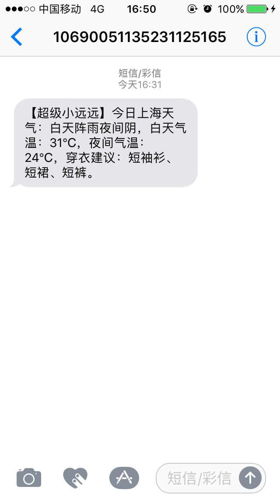

## Nodejs 爬虫
哄女朋友必备.



## Features
+ [node-schedule](https://github.com/node-schedule/node-schedule): nodejs定时任务;
+ [nodemailer](https://github.com/nodemailer/nodemailer): nodejs发送邮件;
+ [pm2](http://pm2.keymetrics.io/): nodejs部署;
+ [alidayu-node](https://github.com/xiaoshan5733/alidayu-node): 阿里大鱼短信平台 nodejs SDK;

## Install
```shell
git clone https://github.com/gosongs/For_Poppy.git
cd For_Poppy
npm install

# 修改 app/config.bak.js 为 app/config.js

# 爬取24小时热门内容, 筛选出点赞数最多的20条, 每天下午6点以邮件的形式发送
node app/modules/jokes.js

# 调取新浪天气接口, 获取指定城市的天气信息, 每天早上8点通过阿里大鱼平台以短信的形式发送
node app/modules/wether.js

# 通过 node-schedule 实现定时任务
node app/main.js
```

## Deploy
```shell
# 远程拷贝到服务器, 或者通过 git 下载
scp For_Poppy <name>@XX.XX.XX.XX:/data/
npm install

# pm2 部署
sudo npm install -g pm2
pm2 start app/main.js
```

## TODO
- [ ] 哄姑奶奶.